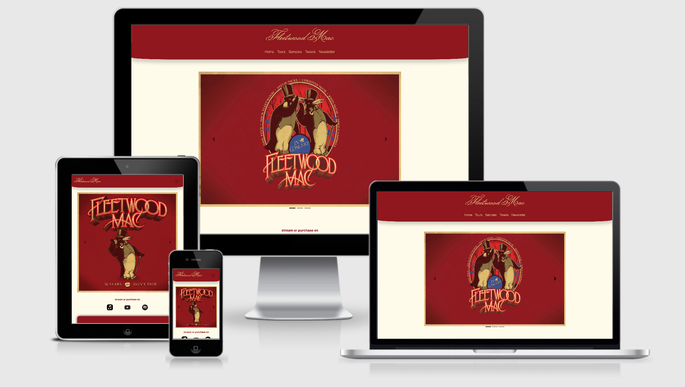
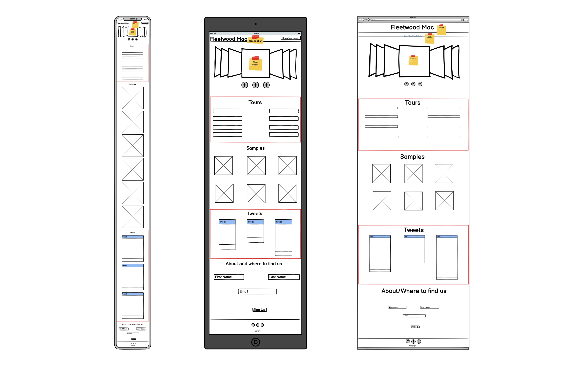

# Fleetwood Mac - Milestone Project 1

## An Overview
This website for the band Fleetwood Mac is created for my first milestone project. For my first project I wanted to build a website showcasing my knowledge of how to use HTML, CSS and Bootstrap together and individually. Showcasing not only a mobile first approach but also how it scales to other devices. 
I settled on the idea of building a website for a band because of the current frustration with artist/band websites where as a user/customer, I cannot get everything I want from most sites (including Fleetwood Mac's own site) and most of them are not as easy to navigate (most rely on taking you to external sites for samples, latest news and latest tour details).
So this site was built to be simplistic to use, yet filled with the relevant details a user would want if they're visiting the stie for the first time or if they're coming back for more.
In this document I will go through what I have built and why, including the ideas I want to implement in the future that I have not been able to so far due to the fact that I have not yet learnt certain languages / frameworks that I would need to include ideas into my first project.

View a live version of my site [here](https://owebster.github.io/MSP-1-Fleetwood_Mac/)

## Table of content
   * UX 
   * UI
   * Objectives
      * For The Site Owner
      * For The User
   * Wireframe
   * Scope
      * Start
      * Middle
      * Ongoing
   * User Stories
   * Features
   * Technologies Used
   * Testing
   * Credits

## UX
### The Experience:

For my first project I wanted to focus on building my site to be as user friendly as possible. Making sure differnt elements on the site act as they should and look as they should. 

For example, when a user typically sees an icon on screen (Music streaming icons or social media icons), they would expect for it to do somehting or take them somehwere that is relevant to the content they are looking at, so even the small twitter icons on the latest tweets section would take you to the relevant tweet, not just twitter.com in general. Or how the music streaming icons take you to the relevant site on desktop or how on mobile, it will take the user to the correct applicaiton (Apple Music to Music App, Spotify to the Spotify App and YouTube to the YouTube App).

Another part of the site I focused on was the journey between differnt secitons. This lead to always having the navigation bar at the top of the site (by using the `sticky-top` funcitonality) to allow users to jump to differnt secitons no matter what part of the site they're on. This scales over all screen sizes, no matter if youre on desktop or mobile. With this choice, I also made the decision to hide the main logo from the page as you scroll down to let users focus on the content of the site with the most space as possible (meaning mobile/small screen users will not need to worry about a big logo taking up most of the space).

### Journey of the Site:
Following on with the expereince of the site, my main focus of building the site was to ensure I had a clear journey for users when visiting the site. This meant that each section flowed with each other and made sense to be one after the other. 
When someone visits the site ->

   * The navbar is going to always be on top to allow users to easily jump between differnt sections.

   * They are greated with the hero carousel, where they can see the latest albums as well as any news about the band.
   
   * Then as they move down, if they any of the hero carousel catches their attention, they are then greated with differnt options to link to the band's streaming services (which mentioned above take users either to the appropriate website or mobile application via the `_blank` target).

   * Users are then greated with the band's latest tour details, with where and when they're playing. This can help entice users to seek out and hopefully purchase tickets (ticket sales feature to be added in the future) to the band's shows, creating excitment for the user and increases the band's ticket sales.

   * From there if users would like to get a taste of what the band can offer, there is a Sample section right underneath. Allowing users to listen to snippets of the band's latest and greatest hits without having to leave the page.

   * Following on from the Sample section, users can see any latest news via the Band's twitter account (directly on the site, but also with associated links to the corrosponding tweets - again with the `_blank` target to ensure users can come back to the site easily even if they go to the social media page)

   * Second to last seciton on the page encourages users to "Sign Up" for the band's newsletter for more informaiton about upcoming tours and albums. This allows users to keep up to date but also will bring users back to the site as Newsletters / updates will direct users back to the webpage (actual newsletter feature to be added in the future).

   * Finally the footer has the relevant social media and streaming services links to remind users where to find the band's. This acts as a "summary" of sorts to remind users about what they have seen throughout the site.


### Colours:
Part of my focus when thinking about UX was the colour scheme as well. I wanted to create a sense of familiarity for users who have seen the latest albums and to associate these colours into new user's minds to remind them of the site when they eventially see the hero image of the site (which is the latest album).
These colours are also good constrasting colours, so accessibility customers can still navigate through out the site without inturuptions.
Because of the contrast of the colours, it also helps with creating a sense of divition between each section.
The primary colours I used are:
   * Deep Red     : #8E191C   - This is being used for the - Hero Logo, Nav Bar, Text (on light gold background) and Section Blocks on ulternating sections
   * Gold         : #e1c281   - This was chosen specifically to match the borders of the latest "Don't Stop, 50 Years" album and be used as the majority of text that have #8E191C as the background colour.
   * Light Gold   : #fffcea   - This light gold acts as the background colour of the entire page. It offers a nice contrast to the Deep Red (#8E191C) and also is easy on the eyes, so even if you're viewing this page on a mobile device with high brightness, it stays soft on the eyes in comparison to standard white.


## UI 
### The Interface:
The site has been built to be modern and mobile first.
This is shown in differnt areas of the site:

   * The Header / Nav bar are rounded off with corner radius and shadow to create a layer sort of effect, where the areas that are Deep Red (#8E191C) are floating ontop of the background (#fffcea). This is also seen with the alternating sections (Tour dates and latest tweets) where they have all four corners rounded off as well.

   * When the user scales up from mobile view, they don't just see a larger image in the hero carousel, they are given a similar image but with more content where possible (differnt style album artwork or differnt image entirely). This is done so the images are not just "larger" more stretched out versions of the ones seen on a mobile site.

   * Nav bar also expands when going from a small screen to medium screen to large screen, expanding the hidden sections from the dropdown menue to be on the navbar itself to utilise the larger space on larger screen devices (desktops, laptops or suitable tablets).

   * Smooth scrolling is enabled for the entire page, mobile and desktop. However Safari does not support this feaures without extra javascript (a feature that I wish to add in the future).

   * Colums also change depending on screen size, on mobile most sections unitlist `col-12` to make sure not too much is on screen at one go. Then on tablet and desktop they respectably change to `col-6`, `col-4` or `col-3` dpending on the content. (seen on Tour section, Music Sample section and Twitter section).


## Objectives
### For the Site Owner:
These are some of the considerations I have taken as a site owner:
   * Making sure that the site is easy to navigate and caters to all people (with and without accessibility needs)
   * To have a website that has colours in which are memerable and easily identifiable as the band's latest colours. As well as being easy on the eye and not too jarring
   * To stand out compared to other bands, by being modern and:
      * To offer a one stop shop for everything related to the band, meaning that the customer does not need to go to differnt websites to get differnt information (tour details, social media and music all under one site)
   * To increase traffic on the site itself (with re-visiting options like Newsletter and the first place to showcase latest music samples etc)
   * To increase traffic on the band's streaming services (which help bring revenue in)
   

### For the User:
And for the user:
   * The user can expect to have a easy to navigate site with clear sections. So that they can easily identify when they're going from one section to another
      * This is also backed by the navbar being always on top
   * The Hero Carousel shows the user the band's latest albums, allowing the user to find out and see what the latest albums look like
   * Streaming services links allow users to easily add and listen to music in popular streaming services, taking them directly to the app on mobile and taking them to the corrosponding site on desktop
   * Tour section is a clean and easy to understand when and where the band will be performing next
   * Music sample section showcases the band's latest and greatest hits wihtin the site, allowing users to explore new music without having to leave the website
   * Tweet section shows that the band is on social media and shows latest tweets to help keep users up to date
   * Newsletter section provides a clear and straightforward signup process (minimal amount of details needed, meaning that users wont feel like they have to give up alot of privacy just to sign up to a newsletter)

## Wireframe:
For my wireframes, I used balsamiq Wireframes to mockup and create the site in differnt device sizes. Shown below are the differnt wireframes for Mobile, Tablet and Desktop. I started with the mobile site and worked from there to scale up the deisgn. You can click on the image for a larger size.



## Accessibility
The site was built with accessibility needs in mind. 
   * All images have the correct alt tags
   * Colours throughout the site offer contrast from on another to ensure easier readability
   * Tested with Lighthouse to improve and fix accessibility concerns

## Scope
I built this project to the schedule that was generated on the Code Institute schedule generator which is ahead of the hard deadline for this project (soft-deadline: 10th November 2020, hard-deadline: 20th November 2020). This meant that it has been my priority to build this website to in line with my soft deadline, to ensure that I am ahead of schedule and maintain a good pace.
I am happy to report that I feel as though I have built a website that meets the criteria that was provided to me as well as utilising the knowledge I have learnt so far all withing the timeframe provided even though I am studying part time.

The approach I took was by splitting the project into differnt sections (Start, Middle and Ongoing). 
   * By doing this I was able to plan out what I wanted to start off with on the website focusing on the basic structure and the differnt sections I wanted to include
   * Then in the middle I focused on the styling of the sections and on-going testing of the site to make sure what I was building functions normally in differnt settings
   * Finally my ongoing section is based on what I want to add in the future with any future technologies I learn

### Start

   * Research and planning: 
      * I first started off by looking at what the band's current webpage looks like and also webpages of other bands to gain inspiration on layout, colours etc. 
      * I then created a basic skeleton in balsamiq
      * From creating the skeleton, I looked at [Bootstrap](https://getbootstrap.com/) for differnt component ideas (nav bar styles, buttons, tables)
      * Researched and chosen logo font type via Google Fonts
   * UI and UX planning
      * Begging with the basic HTML layout, I layed out: 
         * The skeleton of the heading / navbar area
         * The 4 seperate articles and sections within the body (Tours, Samples, Tweets & Newsletter. Tweets was formally known as socials)
         * The footer of the site
      * I thought about the "story" and flow of the site (mentioned above) and planned out where each section would be and how it might look.
         * I used CSS to pair and customise differnt colours and found colours via [ColorTools](https://www.colortools.net/color_complementary.html), which allowed me to analise similar colours and contrasting within the same colour pallet.
      * I took what I had learnt around Bootstrap and imported the framework to help give some contenxt to the website.

### Middle

   * Content
      * As I had layed our and chosen the basic colour scheme of the site, I started brining in the content that I wanted to include:
         * Album art work for hero carousel (also included larger styled artwork for large screen devices)
         * Soundcloud intergration (via soundcloud's own embedding options via their site)
         * Twitter information (originally the site had tweets directly embedded within it, however changed to custom cards to improve accessibility support as well as to improve viewing support on multiple screen sizes)
         * Research on official marketing images for streaming services (Apple Music, Spotify and Youtube all have images provided by each company)
   * Styling
      * Finalised on smaller colour choices for text in differnt sections (making sure there is a good enough contrast difference between background colours and chosen text colours)
      * Downloaded and imported fonts directly into documents to improve load times
      * Researched and included shadowing and radius styles for navbar and alternating sections to create a hover effect on deep red elements - all done with CSS
      * Utilising Bootstrap's base styling options (e.g. "light" or "dark" navbar options) then customising individual elements with CSS

### Ongoing

   * With this ongoing section, this is where I have idea's to build into the site that I might not have had the time to do right now, or have not learnt the appropriate technologies to implement.
      * Hover styling for Tour section (currently implemented hover states for each line, however have not yet implemented a "soldout" hover style on tour dates that have been sold out)
      * Updated card's section for tweets from Twitter (added and styled as of the 18th October)
      * Merchandise section 
         * With checkout options directly on site
      * Personal account section to track tickets for tours and purchased / saved merchandise
      * Smooth Scrolling on Safari (smooth scrolling currently implemented with CSS with the code `scroll-behavior: smooth`, however this is not supported in Safari without adding Javascript)
      * Performance imporvements (ongoing: compressing image sizes, refinements in code)

## User Stories
### Current Fan
I love the band and have been listening to them since I was a child with my parent. I care about and enjoy the fact that the site has everything I need to keep updated to the band and what is happening next, without me having to go to differnt websites for individual bits of information

### New user
I really like the colours of the site and how it's a modern looking site for a band. It's a great feature to discover music right on the site and for the site to be able to bring me to my Spotify app on my phone to show me even more music from the band.

## Features
### Current:
   * Live carousel for latest Albums
      * When in small/mobile view, this shows square images to mimic popular social media formats and to fit on device easier
      * When in medium/large (desktop) view, this shows larger images to fit on screen and fill the screen more, offering a more imersive look
   * Tour table, showcasing upcoming tours
      * When in small/mobile, this is displayed with one country section above the other to offer a less crammped expereince
      * When in medium/large (desktop) view, this is spread out to have both country sections inline with each other
   * Embedded audio sampling from Soundcloud to allow users to listen to song snippets
      * When in small/mobile, this is displayed as one audio track above the other
      * When in medium/large (desktop) view, the tracks go into a 2x3 layout
   * Latest tweet section with cards from Bootstrp
      * When in small/mobile, this is displayed with one card above another
      * When in medium/large (desktop) view, all 3 cards are inline to fill the screen more
   * Newsletter signup section
      * Adaptive to differnt screen sizes, offering same layout accross differnt screen sizes
   * Smooth scrolling (apart from Safari)
   * On all screen view options, the Navbar is sticky on top to offer easier navigation between each section of the site
   * The main header enlarges as deivce screen enlarges from small -> medium -> large to offer the best viewing expereience by not taking up too much space on each respected screen size
   * Curved and shadowing on navbar and sections with deep red to offer a layer/hovering effect, as well as to offer a more modern/comforting feel with the rounded edges

### Future:
   * Performance improvement by refining code and compressing images
   * Adding Javascript to offer:
      * Smooth scrolling on Safari
      * Shop and cart (for merch store)
      * Differnt styling effects for site (replacing some bootstrap e.g. on the navbar)
   * Store to purchase concert tickets and merchandise
   * Live twitter intergration (removes the need for manual editing of tweets)
   * Randomisation of track samples to offer a more diverse catalog

## Technologies used:
   * HTML      - for content and primary language used
   * CSS       - for styling of my project
   * [Bootstrap](https://getbootstrap.com/) - for structure and extra features of the site
   * [Fontawesome](https://fontawesome.com/)
      * fa-twitter for Twitter logo
      * fa-globe-europe for Tour dates section icon
      * fa-headphones-alt for Samples section icon
      * fa-newspaper for newsletter icon
      * fa-apple for Apple logo in footer
      * fa-spotify for spotify logo in footer
      * fa-youtube for Youtube logo in gooter
   * Git/Github (Web and desktop app)
   * Google Fonts - Monsieur La Doulaise
   * Visual Studio Code (VS Code)

## Testing:
### HTML
All HTML code has gone through https://validator.w3.org/ and no errors occur

### CSS
All CSS was tested using https://jigsaw.w3.org and no errors were returned

### Chrome developer tools
When building the site, during each section I used Chrome's inspect and developer tools (such as lighthouse) to validate my work and to ensure the site worked accross multiple screen sizes.
This was also used to debug any structual and/or styling issues ont he fly

### Buttons and Links
All buttons, links and audio that has been embedded has been accounted for and directs to the right source

### Questions asked to users
Whilst building the site I followed up with differnt users to see what their impressions were on the site. Some of the questions I asked to get some valualble feedback were:
   * How do you find the colours of the site?
      * Can you describe how it feels to be looking these colours?
         * Are they easy on the eye?
   * Does the radius around the "top bar" give the site a modern feel?
   * Can you easily go to differnt sections on the site without having to go back to the top?
   * Can you easily see and use the links on the site?
   * Does the newsletter section make it clear about what you're signing up to?
   * Do the "floating" sections make it easy to distinguish between what you're currently viewing and what is coming next?

## Credits:
   * [Bootstrap](https://getbootstrap.com/)
   * [ColorTools](https://www.colortools.net/color_complementary.html) for picking complenmentary and contrasting colours
   * Tutor support from Code institute
      * Stephen for helping sovle font-load times and suggesting:
      ```
      .fade-in {
      opacity: 1;
      animation-name: fadeInOpacity;
      animation-iteration-count: 1;
      animation-timing-function: ease-in;
      animation-duration: 0.5s;
      }
      ```
      * Johann & Miklos for suggestions around background images
   * [w3schools](https://w3schools.com) for learning and improving code
   * [Css-Tricks](https://css-tricks.com/snippets/css/css-box-shadow/) Shadowing code for nav bar and seperate sections: 
      ```
      .shadow {
      -moz-box-shadow:    inset 0 0 10px #000000;
      -webkit-box-shadow: inset 0 0 10px #000000;
      box-shadow:         inset 0 0 10px #000000;
      }
      ```
   * [Stackoverflow](https://stackoverflow.com/questions/54597965/how-do-i-get-nav-menu-to-collapse-on-mobile-but-not-on-desktop) Nav bar auto closing toggle 
   * [Stackoverflow](https://stackoverflow.com/questions/4617872/white-space-showing-up-on-right-side-of-page-when-background-image-should-extend) Spacing issue on   site
   * [Web.dev](https://web.dev/font-display/) Used `font-display: swap;` to improve lighthouse performance score
   * [Favicon Generator](https://www.favicon-generator.org) to generate a favicon for the site
   * My mentor Spencer for helping me along the way on my first project.
   * Everyone who had a look and commented on peer to peer code review on slack