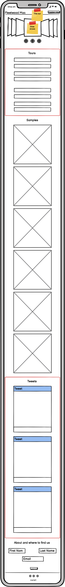

# MSP-1
For my first Milestone project, I have created a website for the band Fleetwood Mac

## The Site
This website show cases the latest and greatest albums from the band Fleetwood Mac. The site is built with my current knowlegde of web developement from the Code Institute, which includeds HTML, CSS and Bootstrap.

The site is deisgned to be mobile first and is fully responsive across all screen sizes.
A live version of the site [here](https://owebster.github.io/MSP-1-Fleetwood_Mac/)
Github Repo [here](https://github.com/owebster/MSP-1-Fleetwood_Mac.git)

## Table of content
* UX & UI
* For Users
* Objectives
* Wireframes
* Scope
* Current Features
* Features to add in the future
* Technologies used
* Credits

## UX & UI
### UX
The main goal for the user exeprience is to offer an easy way for fans and new potential fans to view the latest news, latest tour dates and to be able to easily hear samples of the Band's most popular songs. This is also the place to find links to streaming services to listen and download our music.
### UI
The main goal for the user interface is to provide a simplistic yet intuitive website for users to navigate. Based off the colour scheme of the latest tour poster, gives a sense of familiarity for people who have seen advertisement in real life.
## Objectives
### For the site owner
* To increase streams/downloads on our albums on streaming services
* Increase awareness to our latest news by collating our social media and latest tour details within one site.
   * Increase sales of our tours by having those details within the website
### For the user
* An easy 'one stop shop' for all Fleetwood Mac (tour details, streaming services, latest news and news letter)

## Wireframes

## Scope
### Current Fetures
* 

### Fetures to add in the future
- A sign up / sign in option for users to create an account to keep track of concert ticket orders.
- Merch store that show cases and sells the band's merchandise
- Hover states on tour dates that shows either sold our or avaliable shows and directs customers to ticketing website
- Newsletter sign up for latest news from the band (curretly there but not active)

## Technologies used
These are the languages, framework and resources that I used to build this website:
- HTML
- CSS
- Bootstrap
- Fontawesome
- Github (Web and desktop app)
- Visual Studio Code (VS Code)

## Credits
- [Bootstrap] (https://getbootstrap.com/)
- [ColorTools] (https://www.colortools.net/color_complementary.html) for picking complenmentary and contrasting colours
- Tutor support from Code institute
- [w3schools] (https://w3schools.com) for learning and improving code
- [Css-Tricks] (https://css-tricks.com/snippets/css/css-box-shadow/) '.shadow {
   -moz-box-shadow:    inset 0 0 10px #000000;
   -webkit-box-shadow: inset 0 0 10px #000000;
   box-shadow:         inset 0 0 10px #000000;
   }'
- [Stackoverflow] (https://stackoverflow.com/questions/54597965/how-do-i-get-nav-menu-to-collapse-on-mobile-but-not-on-desktop) Nav bar auto closing toggle 
- [Stackoverflow] (https://stackoverflow.com/questions/4617872/white-space-showing-up-on-right-side-of-page-when-background-image-should-extend) Spacing issue on   site
- [Web.dev] (https://web.dev/font-display/) Used 'font-display: swap;' to improve lighthouse score